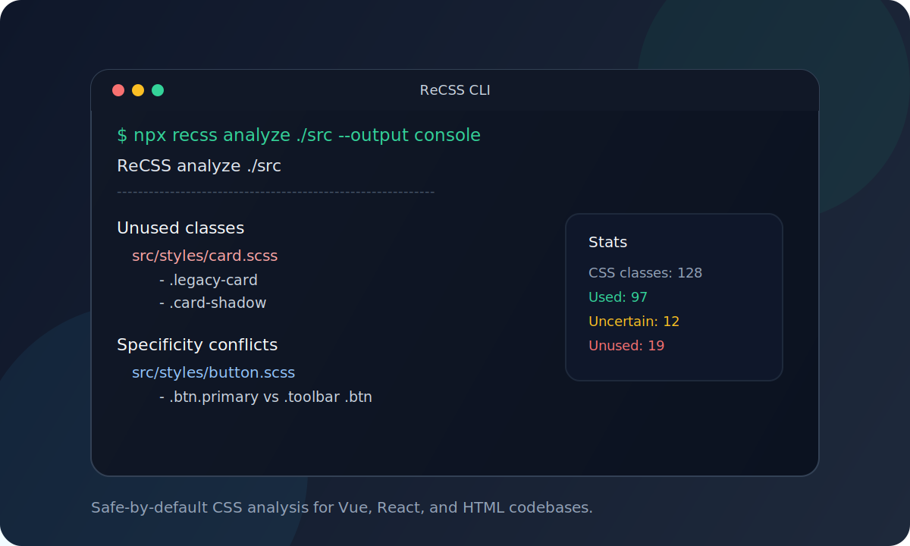

# ReCSS

[](https://github.com/Naloam/ReCSS)
[](https://github.com/Naloam/ReCSS/actions/workflows/ci.yml)
[](./LICENSE)
[](https://github.com/Naloam/ReCSS/stargazers)

> Find dead CSS before it finds you.

<p align="center">
  
</p>

ReCSS is a focused TypeScript tool for CSS health analysis in real front-end repositories. It helps teams answer three painful questions fast:

- Which CSS classes are definitely used?
- Which selectors look dead and safe to review?
- Where is specificity becoming a maintenance problem?

It also gives you a conservative CSS Modules migration path instead of forcing you into an all-or-nothing rewrite.

## Why ReCSS

If you have ever opened a five-year-old `styles.scss` file and hesitated before deleting a selector because "something somewhere probably still uses it", ReCSS is the tool for that moment.

Most CSS cleanup tools start from the production bundle. ReCSS starts from your source tree. It is designed for legacy Vue, React, and mixed codebases where the real problem is not "optimize harder", but "show me what is safe to touch".

ReCSS is conservative by design:

- Dynamic classes are treated as uncertain instead of aggressively reported as unused.
- CSS Modules are skipped instead of being guessed.
- Migration helpers rewrite common patterns, but leave ambiguous cases alone.

## What You Get

- `recss analyze`
  Find unused CSS and SCSS classes from Vue, React, and HTML sources.
- `recss check`
  Detect specificity conflicts and `!important` heavy areas before they become style wars.
- `recss migrate --apply`
  Copy plain style files to CSS Modules equivalents and rewrite common class references.
- `@recss/vite-plugin`
  Show warnings during local HMR workflows.
- `@recss/vscode-extension`
  Surface inline diagnostics, quick fixes, and a file-level fix-all action.

## Quick Start

```bash
pnpm add -D recss
recss analyze .
recss check .
recss migrate ./src/components/button --apply
```

Workspace development:

```bash
pnpm install
pnpm build
pnpm lint
pnpm test
```

## CLI Commands

```bash
recss analyze [dir] [--framework auto|vue|react|html] [--output console|json|html] [--config <path>] [--safelist a,b] [--outfile report-path]
recss check [dir] [--framework auto|vue|react|html] [--threshold 0] [--config <path>]
recss init [dir]
recss migrate [component-dir] [--apply]
```

## Migration Assistant

`recss migrate --apply` is intentionally pragmatic, not magical.

Current rewrite coverage includes:

- React string literals, template literals, `clsx` / `cn` / `classnames`, arrays, filter/join chains, concat chains, conditional/logical expressions, binary string concatenation, wrapper calls, and several optional-call variants.
- Vue static `class`, object `:class`, array `:class`, mixed static + dynamic bindings, custom style module aliases, `useCssModule()` accessors, and wrapper calls around supported expressions.

It will not guess through ambiguous module imports or highly dynamic expressions. That is deliberate.

## Packages

- [recss](./packages/cli) - CLI for analysis, checking, config bootstrap, and migration.
- [@recss/core](./packages/core) - core engine for parsing, analysis, reporting, and migration helpers.
- [@recss/vite-plugin](./packages/vite-plugin) - Vite integration for dev-time warnings.
- [@recss/vscode-extension](./packages/vscode-extension) - VS Code extension for diagnostics and quick actions.

## Current Status

ReCSS is mature enough for early public use and real repository trials. The project already ships:

- CLI workflows
- JSON / Markdown / HTML reporting
- Specificity analysis
- CSS Modules migration helpers
- Vite integration
- VS Code diagnostics and source-edit quick fixes

The roadmap from here is mostly deeper coverage, not a missing foundation.

## What ReCSS Is Not

- Not a production CSS tree-shaker
- Not a CSS-in-JS framework
- Not a destructive autofix tool that guesses through dynamic code

## Release

This repo uses Changesets for package versioning and npm release orchestration.

```bash
pnpm changeset
pnpm version-packages
pnpm release
```

Release automation is wired through [`.changeset/config.json`](./.changeset/config.json) and [`.github/workflows/release.yml`](./.github/workflows/release.yml).

## License

[MIT](./LICENSE)

If ReCSS saves you time in a messy stylesheet, star the repo.
